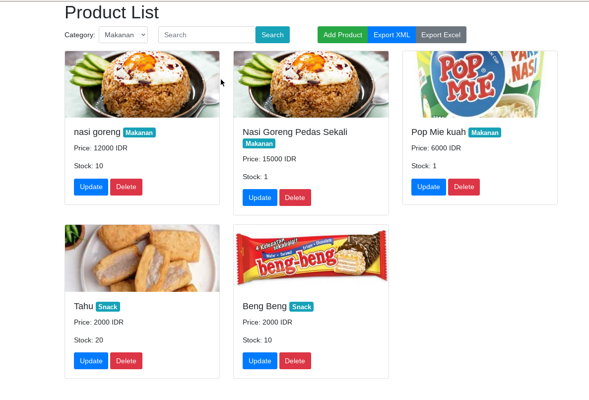

# Product and Score Management System

## Overview

A Node.js application for managing products and scores with features like exporting data, viewing statistics, and handling different emotions.


## Product


## Score


## Requirements
- Node.js (>=14.x)
- MySQL (>=5.7)
- Docker (optional, for containerized setup)

## Installation

### 1. Clone the repository

```bash
 git clone https://github.com/putra-asmarjoe/PanelResto.git
 cd PanelResto
```

### 2. Install dependencies

```bash
npm install
```

### 3. Set up database
Create the MySQL database `panelresto` and grant necessary permissions to the user specified in your .env file (MYSQL_USER).


### 4. Set up environment variables
#### Create a `.env` file in the root directory with the following variables:

```makefile
DB_NAME=panelresto
DB_USER=root
DB_PASSWORD=
DB_HOST=localhost
DB_PORT=3307
```
Make sure to adjust MYSQL_USER and MYSQL_PASSWORD to match your MySQL credentials.

## Usage

### Manual

```bash
npm start
```

### Run with Docker Compose
 #### Alternatively, you can use Docker Compose to run in a single command:
 ```bash
 docker-compose -f docker-compose.yml up -d --build
 ```


## Access the Application
```
Product List: http://localhost:3000/
Score List: http://localhost:3000/score
```


## License

This project is licensed under the MIT License. See the [LICENSE](LICENSE) file for details.
